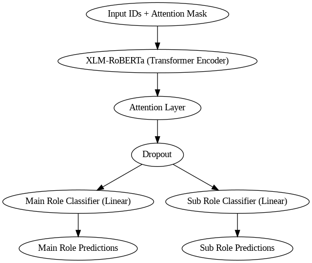

# Entity Framing in Narratives: Multi-Label Role Classification of Named Entities

## Model Overview

This project uses a **XLM-RoBERTa-base** model with an attention layer and two output heads to perform multi-label role classification of named entities in text. The model is designed to predict both the **main role** and **fine-grained roles** of named entities in a multilingual dataset.

The dataset used in this project is from **SemEval 2025 Task 10**: [Propaganda Detection](https://propaganda.math.unipd.it/semeval2025task10/), and the problem addressed in this project is **Subtask 1: Role Classification of Named Entities**.

The architecture includes the following components:
- **XLM-RoBERTa-base**: A powerful multilingual transformer model designed for cross-lingual tasks.
- **Attention Mechanism**: Helps the model focus on the relevant parts of the input text.
- **Focal Loss**: Addresses class imbalance, improving the model's ability to handle underrepresented classes.



## Project Files

- **Dataset_EN_PT**: Contains the text data for the articles. Each text file is named according to the corresponding article ID.
- **train.csv**: Training data with columns `article_id`, `main_role`, and `fine_grained_roles`.
- **test.csv**: Test data with the same columns as `train.csv`.
- **val.csv**: Validation data with the same columns as `train.csv`.
- **results**: Contains the trained model's outputs, including metrics, predictions, and the model itself.
- **model.ipynb**: Jupyter notebook with code for data loading, model training, evaluation, and visualization.

## Methodology

The methodology combines key components for effective multi-label classification:

1. **Pretrained Model**: We use the **XLM-RoBERTa-base** model, a multilingual transformer with 278 million parameters, trained to handle various cross-lingual tasks. This model processes the input text and generates contextual embeddings for named entity classification.

2. **Loss Function**: The **Adapted Focal Loss** is used to tackle the class imbalance problem. The Focal Loss applies a dynamic modulating factor to focus on hard-to-classify examples, which is particularly useful in tasks with imbalanced class distributions.

    ### Adapted Focal Loss Formula
    ```
    FL(p_t) = α (1 - p_t)^γ * BCE(p_t)
    ```
    Where:
    - **BCE(p_t)**: Binary cross-entropy loss
    - **p_t**: Predicted probability derived from logits
    - **α**: Class balancing factor
    - **γ**: Focusing parameter to reduce the weight of easy-to-classify examples

3. **Model Architecture**: The architecture uses **XLM-RoBERTa-base** as the core transformer model, with two classification heads for predicting the **main role** and **sub roles** of named entities. The model uses multi-task learning, where shared representations from the transformer encoder are used for both tasks.

    - **Input Layer**: Tokenized input sequences with attention masks.
    - **Transformer Encoder**: Processes input through 12 layers of self-attention and feed-forward networks.
    - **Dropout Layer**: Prevents overfitting.
    - **Main Role & Sub Role Classifiers**: Parallel classification heads that predict the main role and fine-grained roles.

## Running the Project

### Setup Instructions:
1. **Set up Google Colab**: Create a new Colab notebook and upload the project files.
2. **Install Dependencies**: Install necessary libraries like `transformers`, `torch`, `sklearn`, and `pandas`.
3. **Mount Google Drive**: Mount your Google Drive to access the data.
4. **Run the Notebook**: Execute the cells in the `model.ipynb` notebook sequentially to train, evaluate, and visualize the results.

### Results:
The results are saved in the `results` folder, including evaluation metrics, predicted roles, and trained model outputs. Plots of metrics during training are also displayed within the notebook.

## Future Work

Possible improvements and extensions for this project include:
- **Hyperparameter Tuning**: Experimenting with different hyperparameters for better model performance.
- **Data Augmentation**: Expanding the training dataset to improve model robustness.
- **Ensemble Methods**: Using multiple models to increase generalization.
- **Interpretability**: Investigating methods to interpret model predictions for better insights.

## Acknowledgements

- **XLM-RoBERTa**: Developed by Facebook AI.
- **Hugging Face Transformers**: A library for working with transformer models.
- - **SemEval 2025 Task 10**: For providing the dataset and framework for evaluating the task of entity role classification in narratives.
- **Focal Loss**: Introduced by [Lin et al.](https://arxiv.org/abs/1708.02002), Focal Loss helps improve model performance by focusing on hard-to-classify examples and addressing class imbalance, which is crucial for this task.
- **Google Colab**: A platform that provides free access to powerful computing resources for model training and experimentation.
- **Pytorch**: Used for implementing and training deep learning models.
- **Scikit-learn**: Used for metrics and machine learning utilities.
- **Pandas**: Used for data manipulation and analysis.
- **OpenAI**: For providing access to GPT-3, a source of inspiration for the development and understanding of large language models.
- **The Research Community**: For contributing to the continuous development of transformer models, attention mechanisms, and the concept of multi-task learning.
